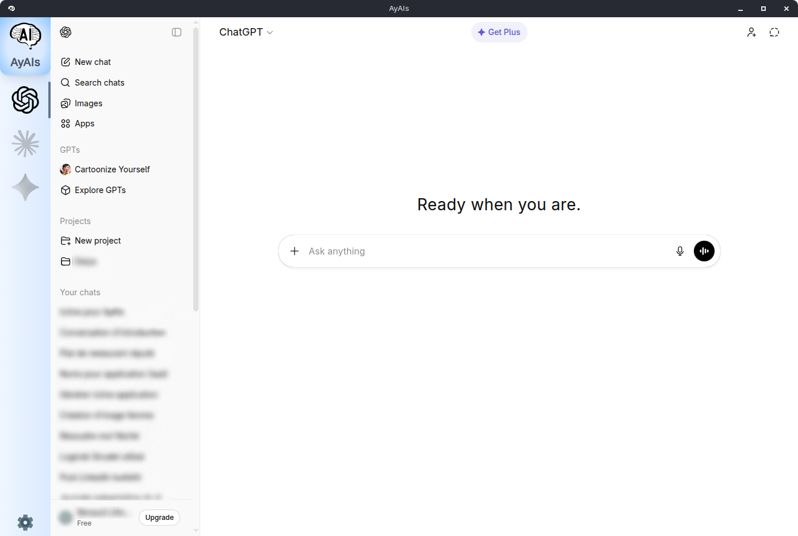
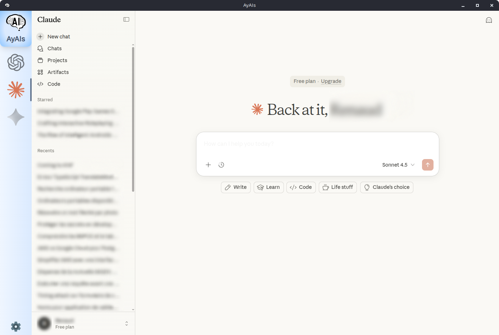
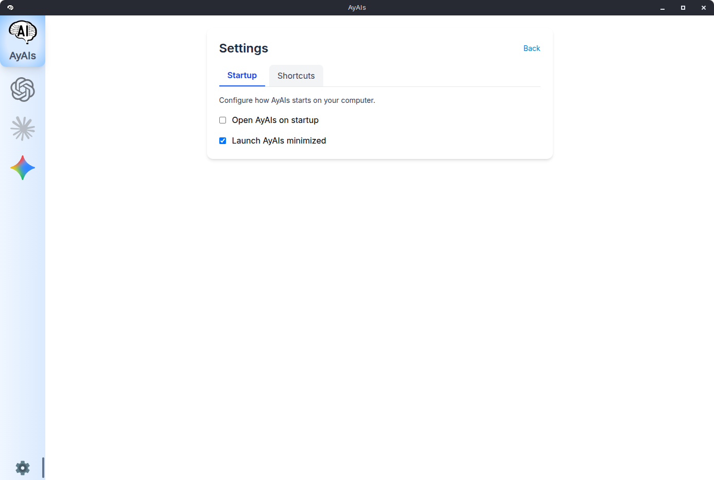

# AyAIs - All your AIs

A cross-platform desktop application that provides quick and seamless access to multiple AI services through an integrated browser interface.


## Table of Contents

- [Features](#features)
- [Screenshots](#screenshots)
- [Installation](#installation)
  - [Windows](#windows)
  - [macOS](#macos)
  - [Linux](#linux)
- [Development](#development)
- [Testing](#testing)
- [Configuration](#configuration)
- [Supported AI Services](#supported-ai-services)
- [Keyboard Shortcuts](#keyboard-shortcuts)
- [Tech Stack](#tech-stack)
- [Contributing](#contributing)
- [License](#license)
- [Support](#support)
- [Roadmap](#roadmap)

## Features

- **Multiview Interface**: Sidebar navigation with colored icons for instant switching between AI services
- **Integrated Browser**: Built-in webview component with persistent sessions and cookies
- **Global OS Shortcuts**: System-wide hotkeys to quickly show/hide the application (customizable soon)
- **Multiple AI Services**: Native support for ChatGPT, Claude, and Gemini (more coming soon)
- **Auto-Startup**: Optional system integration for automatic launch on system startup
- **Session Persistence**: Maintain browser sessions and cookies between app restarts
- **Quick Switching**: Instant navigation between different AI services without reloading

## Screenshots


_ChatGPT integration_


_Claude integration_


_Settings_

## Installation

### Download Pre-built Binaries

Visit the [Releases](https://github.com/marmotz/ayais/releases) page to download the latest version for your operating system.

#### Windows

1. Download `AyAis-Setup-x.x.x.exe`
2. Run the installer
3. Follow the installation wizard
4. Launch AyAIs from the desktop shortcut or Start menu

#### macOS

Due to Apple's strict security restrictions (Gatekeeper), you'll need to remove the quarantine attribute from the application. Choose one of the following methods:

**Method 1: Download and install with quarantine removal**

```bash
# Get the latest macOS release URL and download
DOWNLOAD_URL=$(curl -s "https://api.github.com/repos/marmotz/AyAIs/releases/latest" | grep "browser_download_url.*dmg" | cut -d '"' -f 4 | head -n 1)

# Download and remove quarantine attribute
curl -L "$DOWNLOAD_URL" -o AyAis_installer.dmg && xattr -d com.apple.quarantine AyAis_installer.dmg 2>/dev/null || true

# Open the DMG to proceed with installation
open AyAis_installer.dmg
```

After the download completes, open the DMG and drag AyAis to your Applications folder.

**Method 2: Install normally then remove quarantine**

1. Download `AyAis-x.x.x.dmg` from the [Releases](https://github.com/marmotz/AyAIs/releases) page
2. Open the downloaded DMG file
3. Drag AyAis to your Applications folder
4. Run the following command in Terminal to remove the quarantine attribute:

```bash
sudo xattr -rd com.apple.quarantine /Applications/AyAis.app
```

Enter your password when prompted. You'll now be able to launch AyAis from Applications without security warnings.

#### Linux

1. Download `AyAis-x.x.x.AppImage`
2. Make the file executable:
   ```bash
   chmod +x AyAis-x.x.x.AppImage
   ```
3. Run the application:

   ```bash
   ./AyAis-x.x.x.AppImage
   ```

## Development

### Clone the Repository

```bash
git clone https://github.com/marmotz/AyAIs.git
cd AyAIs
```

### Install Dependencies

```bash
npm install
```

### Development Mode

Start the application in development mode with hot-reload:

```bash
npm run start
```

### Build for Production

#### Electron Build

Build the application for your current platforms:

```bash
npm run electron:build
```

The built application will be in the `release/` directory.

## Testing

### Unit Tests

```bash
# Run all tests
npm run test

# Run tests in watch mode
npm run test:watch

# Run tests with coverage
ng test --watch=false --coverage

# Run specific test file
ng test --include="**/component-name.spec.ts"
```

### End-to-End Tests

```bash
# Run E2E tests
npm run e2e

# Run E2E with tracing (for debugging)
npm run e2e:show-trace
```

## Configuration

AyAis stores its configuration and user data in the following locations:

- **Windows**: `%APPDATA%/ayais`
- **macOS**: `~/Library/Application Support/ayais`
- **Linux**: `~/.config/ayais`

Configuration file: `config.json`

## Supported AI Services

- **ChatGPT** (https://chat.openai.com)
- **Claude** (https://claude.ai)
- **Gemini** (https://gemini.google.com)

(more coming soon)

## Keyboard Shortcuts

| Action                | Win/Linux Default Shortcut | Mac Default Shortcut |
| --------------------- | -------------------------- | -------------------- |
| Show/Hide Application | `Super+I` (Win/Linux)      | `Cmd+I` (Mac)        |

## Tech Stack

- **Frontend**: Angular 21
- **UI Components**: PrimeNG
- **Styling**: TailwindCSS
- **Desktop Framework**: Electron
- **Testing**: Vitest (unit), Playwright (E2E)
- **Build Tools**: Angular CLI, electron-builder

## Contributing

1. Fork the repository
2. Create a feature branch: `git checkout -b feature/your-feature-name`
3. Commit your changes: `git commit -m 'Add some feature'`
4. Push to the branch: `git push origin feature/your-feature-name`
5. Submit a pull request

Please follow the [AGENTS.md](AGENTS.md) development guidelines when contributing.

## License

This project is licensed under the MIT License - see the [LICENSE](LICENSE) file for details.

## Support

- **Issues**: [GitHub Issues](https://github.com/marmotz/AyAIs/issues)

## Roadmap

- [ ] Support for additional AI services
- [ ] Custom shortcuts
- [ ] Multi-language support (i18n)

---

Made with ❤️ for the AI community
